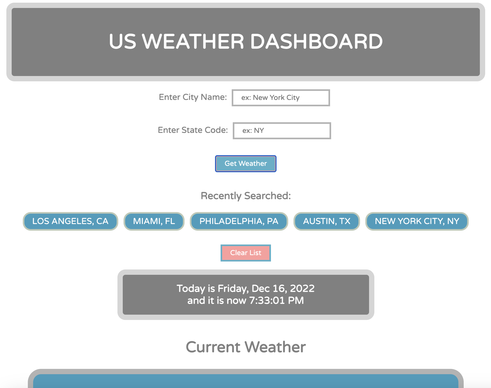

# Challenge 6: Weather Dashboard

## Description

This is a convenient App for you to check your US city weather and 5-day forecast.
Simply enter the city and state code, and you'll be presented with the current weather condition (description, temperature, wind speed, and humidity), followed by a 5-day weather forecast of the city. If you failed to enter both city and state code for the search, you will be prompted to do so to proceed. If the info you entered failed to return any data, you will be alerted accordingly. If the city and state code are both correct, when you click on "Get Weather", the window will scroll down to the current weather section. 

Once you've successfully searched for a city, the city is listed under "Recently Searched", and can be accessed for the updated weather by clicking on it. 

There's also a clock in the middle of the page for users to check the date and time. It also has a countdown sound effect that beeps on the hour. 

At the bottom of the page is a "Back to Top" button for users to be taken back to the top of the webpage for another search. 

The URL of the deployed, refactored webpage is can be found at: https://feddericowayne.github.io/Challenge-4-Workday-Scheduler/

Here's a screenshot of the webpage:

## Installation

N/A

## Usage

Use this App to check your local current US weather and 5-Day forecast.

## Credits

N/A

## License

Please refer to the LICENSE in the repo.

