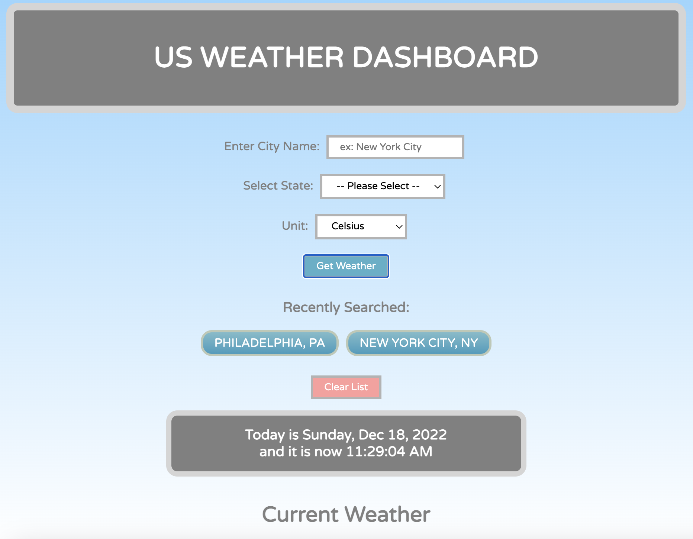
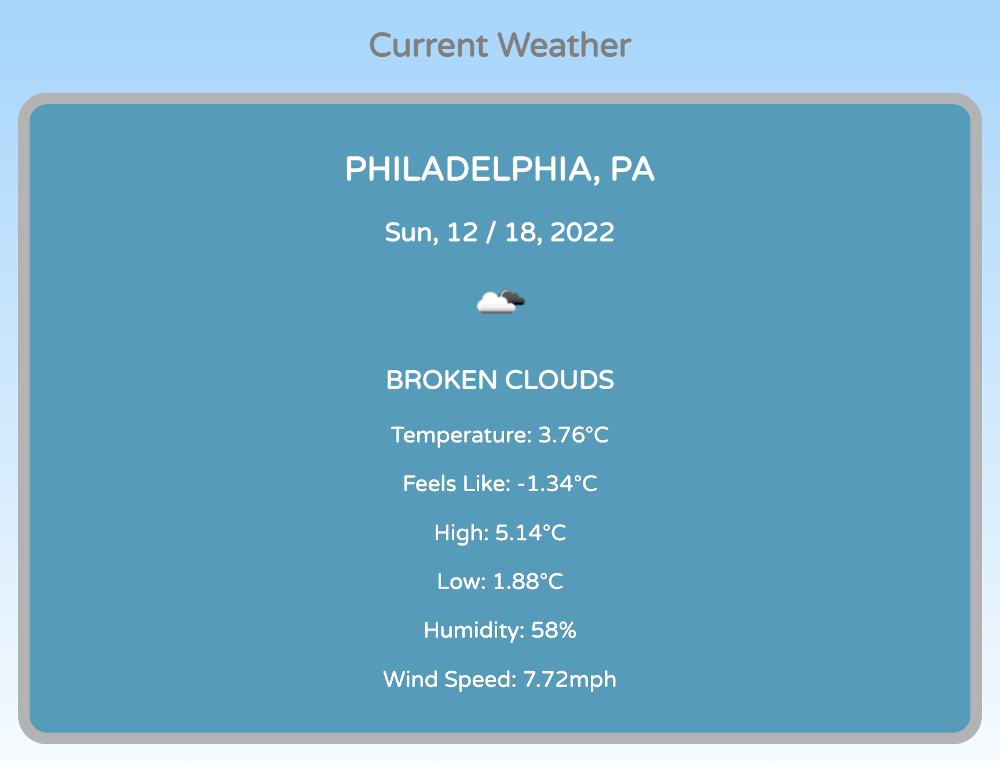

# Challenge 6: Weather Dashboard

## Description

This is a convenient App for you to check your US city weather and 5-day forecast.
Simply enter the city and select the state from the drop-down menu, and you'll be presented with the current weather condition (description, temperature, wind speed, and humidity), followed by a 5-day weather forecast of the city. If you fail to enter both city and state for the search, you will be prompted to do so to proceed. If the info you enter fails to return any data, you will be alerted accordingly. If the city and state entered are both correct, when you click on "Get Weather", the window will scroll down to display the current weather of the city. 

Once you've successfully searched for a city, that city will be listed under "Recently Searched", and can be accessed in the future for its updated weather by clicking. The "Clear List" button allows users to clear their search history and repopulate a new list.

There's also a clock in the middle of the page for users to check the date and time. It also has a countdown sound effect that beeps on the hour. 

At the bottom of the page is a "Back to Top" button for users to be taken back to the top of the webpage for another search. 

This App is created for both large and small viewports.

The URL of the deployed webpage can be found at: https://feddericowayne.github.io/Weather-Dashboard/

Here's a screenshot of the webpage:

## Installation

N/A

## Usage

Use this App to check your local current US weather and 5-Day forecast.

## Credits

N/A

## License

Please refer to the LICENSE in the repo.

